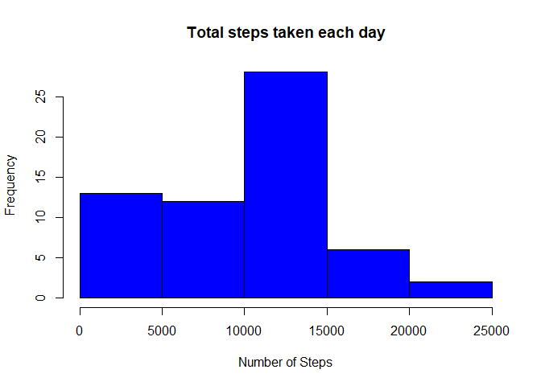
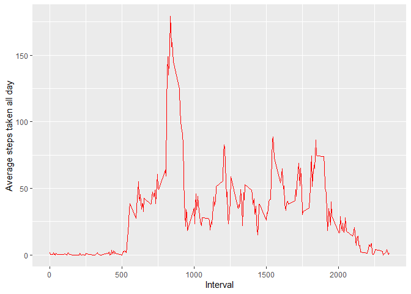
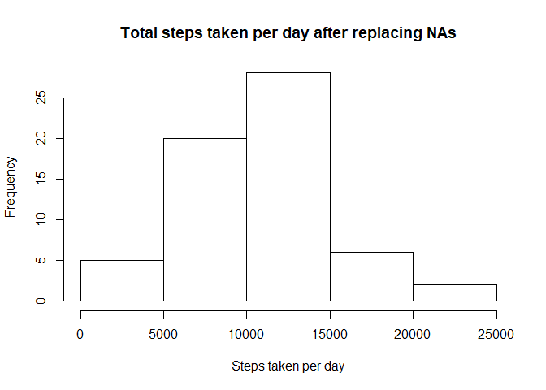
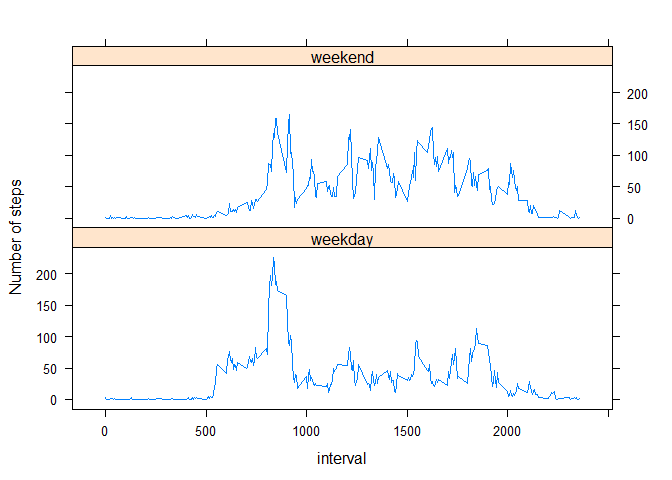

## Loading and preprocessing the data
Download and read file


```r
download.file("https://d396qusza40orc.cloudfront.net/repdata%2Fdata%2Factivity.zip","temp.zip")
file<-unzip("temp.zip")
file1<-read.csv(file)
```
## What is mean total number of steps taken per day?
Calculate total steps taken

```r
totalsteps<-aggregate(file1$steps,by=list(file1$date),sum,na.rm=TRUE)
```

Make a histogram of total steps taken every day

```r
hist(totalsteps$x,main = paste("Total steps taken each day"), col="blue",xlab="Number of Steps")
```

<!-- -->

Calculate Median (stepsmedian) and Mean (stepsmean) steps taken every day

```r
stepsmean<-mean(totalsteps$x)
stepsmean
```

```
## [1] 9354.23
```

```r
stepsmedian<-median(totalsteps$x)
stepsmedian
```

```
## [1] 10395
```
## What is the average daily activity pattern?

Average Daily Pattern

```r
dailysteps<-aggregate(file1$steps,by=list(file1$interval),sum,na.rm=TRUE)
names(dailysteps)<-c("interval","total_steps")
day<-nrow(file1)/288
dailysteps$average_steps<-dailysteps$total_steps/day
library(ggplot2)
ggplot(dailysteps,aes(dailysteps$interval,dailysteps$average_steps))+geom_line(color="red")+ xlab("Interval")+ylab("Average steps taken all day")
```

<!-- -->
Get maximum steps taken per day in a five-minute interval

```r
max(dailysteps$average_steps)
```

```
## [1] 179.1311
```
## Imputing missing values
Count number of NAs in the dataset

```r
sum(is.na(file1))
```

```
## [1] 2304
```

Stratages to replace NAs in the dataset

```r
#Replace NA with average step on a certain interval, new dataframe is mdata
mdata<-merge(dailysteps,file1, by.x = "interval",by.y = "interval")
for (i in 1: length(mdata$steps))
{
  if (is.na(mdata$steps[i]))
  {
  mdata$steps[i] <-mdata$average_steps[i]
  }
  
}
# Order new dataframe by date to get back to making an equivalent dataframe
mdata1<-mdata[order(as.Date(mdata$date,format="%Y-%m-%d")),]
#Create equivalent dataframe with missing values filled in
a<-mdata1$steps
c<-mdata1$interval
b<-as.Date(mdata1$date)
#Equivalent dataframe without NAs

new<-data.frame(a,b,c)
names(new)<-c("steps","date","interval")
head(new)
```

```
##        steps       date interval
## 1 1.49180328 2012-10-01        0
## 2 0.29508197 2012-10-01        5
## 3 0.11475410 2012-10-01       10
## 4 0.13114754 2012-10-01       15
## 5 0.06557377 2012-10-01       20
## 6 1.81967213 2012-10-01       25
```


```r
#Make a histogram of total steps taken every day- from new dataframe without NAs
totalsteps_new<-aggregate(new$steps,by=list(new$date),sum)
#Create histogram of total steps taken per day without NAs
hist(totalsteps_new$x,main = "Total steps taken per day after replacing NAs",xlab = "Steps taken per day")
```

<!-- -->

```r
#Mean steps every day_new
stepsmean_new<-mean(totalsteps_new$x)
stepsmean_new
```

```
## [1] 10581.01
```

```r
#Median total steps taken every day_new
stepsmedian_new<-median(totalsteps_new$x)
stepsmedian_new
```

```
## [1] 10395
```

Set up Weekend and Weekday factor in the dataframe 

```r
new$day<-weekdays(new$date)
weekday<-c("Monday","Tuesday","Wednesday","Thursday","Friday")
new$day[new$day %in% weekday]<-"weekday"
weekend<-c("Saturday","Sunday")
new$day[new$day %in% weekend]<-"weekend"
new$day<-as.factor(new$day)
head(new)
```

```
##        steps       date interval     day
## 1 1.49180328 2012-10-01        0 weekday
## 2 0.29508197 2012-10-01        5 weekday
## 3 0.11475410 2012-10-01       10 weekday
## 4 0.13114754 2012-10-01       15 weekday
## 5 0.06557377 2012-10-01       20 weekday
## 6 1.81967213 2012-10-01       25 weekday
```
---
title: "Reproducible Research: Peer Assessment 1"
output: 
  html_document:
    keep_md: true
---
## Loading and preprocessing the data
Download and read file


```r
download.file("https://d396qusza40orc.cloudfront.net/repdata%2Fdata%2Factivity.zip","temp.zip")
file<-unzip("temp.zip")
file1<-read.csv(file)
```
## What is mean total number of steps taken per day?
Calculate total steps taken

```r
totalsteps<-aggregate(file1$steps,by=list(file1$date),sum,na.rm=TRUE)
```

Make a histogram of total steps taken every day

```r
hist(totalsteps$x,main = paste("Total steps taken each day"), col="blue",xlab="Number of Steps")
```

<!-- -->

Calculate Median (stepsmedian) and Mean (stepsmean) steps taken every day

```r
stepsmean<-mean(totalsteps$x)
stepsmean
```

```
## [1] 9354.23
```

```r
stepsmedian<-median(totalsteps$x)
stepsmedian
```

```
## [1] 10395
```
## What is the average daily activity pattern?

Average Daily Pattern

```r
dailysteps<-aggregate(file1$steps,by=list(file1$interval),sum,na.rm=TRUE)
names(dailysteps)<-c("interval","total_steps")
day<-nrow(file1)/288
dailysteps$average_steps<-dailysteps$total_steps/day
library(ggplot2)
ggplot(dailysteps,aes(dailysteps$interval,dailysteps$average_steps))+geom_line(color="red")+ xlab("Interval")+ylab("Average steps taken all day")
```

<!-- -->

Get maximum steps taken per day in a five-minute interval

```r
max(dailysteps$average_steps)
```

```
## [1] 179.1311
```
## Imputing missing values
Count number of NAs in the dataset

```r
sum(is.na(file1))
```

```
## [1] 2304
```

Stratages to replace NAs in the dataset

```r
#Replace NA with average step on a certain interval, new dataframe is mdata
mdata<-merge(dailysteps,file1, by.x = "interval",by.y = "interval")
for (i in 1: length(mdata$steps))
{
  if (is.na(mdata$steps[i]))
  {
  mdata$steps[i] <-mdata$average_steps[i]
  }
  
}
# Order new dataframe by date to get back to making an equivalent dataframe
mdata1<-mdata[order(as.Date(mdata$date,format="%Y-%m-%d")),]
#Create equivalent dataframe with missing values filled in
a<-mdata1$steps
c<-mdata1$interval
b<-as.Date(mdata1$date)
#Equivalent dataframe without NAs

new<-data.frame(a,b,c)
names(new)<-c("steps","date","interval")
head(new)
```

```
##        steps       date interval
## 1 1.49180328 2012-10-01        0
## 2 0.29508197 2012-10-01        5
## 3 0.11475410 2012-10-01       10
## 4 0.13114754 2012-10-01       15
## 5 0.06557377 2012-10-01       20
## 6 1.81967213 2012-10-01       25
```


```r
#Make a histogram of total steps taken every day- from new dataframe without NAs
totalsteps_new<-aggregate(new$steps,by=list(new$date),sum)
#Create histogram of total steps taken per day without NAs
hist(totalsteps_new$x,main = "Total steps taken per day after replacing NAs",xlab = "Steps taken per day")
```

<!-- -->

```r
#Mean steps every day_new
stepsmean_new<-mean(totalsteps_new$x)
stepsmean_new
```

```
## [1] 10581.01
```

```r
#Median total steps taken every day_new
stepsmedian_new<-median(totalsteps_new$x)
stepsmedian_new
```

```
## [1] 10395
```

Set up Weekend and Weekday factor in the dataframe 

```r
new$day<-weekdays(new$date)
weekday<-c("Monday","Tuesday","Wednesday","Thursday","Friday")
new$day[new$day %in% weekday]<-"weekday"
weekend<-c("Saturday","Sunday")
new$day[new$day %in% weekend]<-"weekend"
new$day<-as.factor(new$day)
head(new)
```

```
##        steps       date interval     day
## 1 1.49180328 2012-10-01        0 weekday
## 2 0.29508197 2012-10-01        5 weekday
## 3 0.11475410 2012-10-01       10 weekday
## 4 0.13114754 2012-10-01       15 weekday
## 5 0.06557377 2012-10-01       20 weekday
## 6 1.81967213 2012-10-01       25 weekday
```

## Are there differences in activity patterns between weekdays and weekends?
Analyse weekday and weekend activity

```r
#total steps taken averaged over weekdays
weekday_data<-subset(new,new$day=="weekday")
stepsweekday<-aggregate(weekday_data$steps,by=list(weekday_data$interval),sum)
#Median and Mean with NAs and without NAs
means<-c(stepsmean,stepsmean_new)
medians<-c(stepsmedian,stepsmedian_new)
summarytable<-data.frame(rbind(means,medians))
colnames(summarytable)<-(c("Data with NAs", "Data without NAs"))
rownames(summarytable)<-(c("mean","median"))
# A table to summarize the mean and median of steps taken everyday with NAs and without NAs
summarytable
```

```
##        Data with NAs Data without NAs
## mean         9354.23         10581.01
## median      10395.00         10395.00
```

```r
#calculate the number of weekdays, 
n_weekday<-nrow(weekday_data)/288
n_weekday
```

```
## [1] 45
```

```r
#Averaged steps taken per day at weekdays
steps_weekday<-stepsweekday$x/n_weekday
data3<-data.frame(cbind(stepsweekday$Group.1,steps_weekday))
names(data3)<-c("interval","steps")
data3$day<-c("weekday")
#total steps taken averaged over weekends
weekend_data<-subset(new,new$day=="weekend")
stepsweekend<-aggregate(weekend_data$steps,by=list(weekend_data$interval),sum)
#calculate the number of weekdays, 
n_weekend<-nrow(weekend_data)/288
n_weekend
```

```
## [1] 16
```

```r
#Averaged steps taken per day at weekdays
steps_weekend<-stepsweekend$x/n_weekend
data4<-data.frame(cbind(stepsweekend$Group.1,steps_weekend))
names(data4)<-c("interval","steps")
data4$day<-c("weekend")
#Combine dataframes into one
combdata<-data.frame(rbind(data3,data4))
#Plot a panel of plots
library(lattice)
xyplot (steps ~ interval|day, data = combdata, layout=c(1,2), type="l",ylab = "Number of steps")
```

<!-- -->


